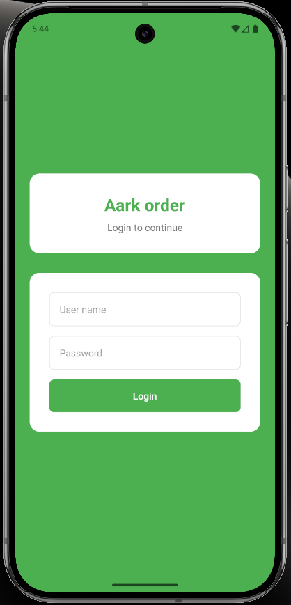
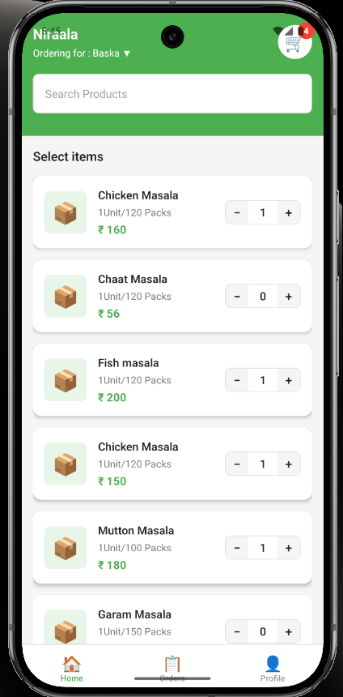
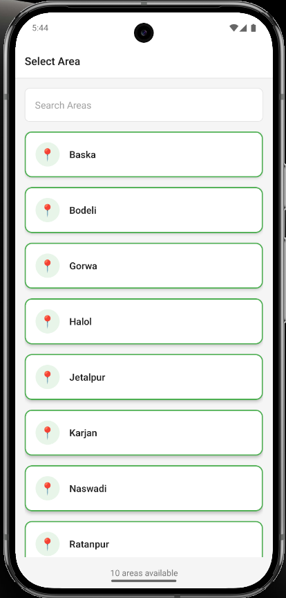
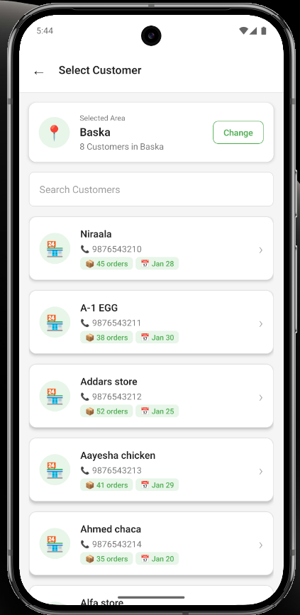
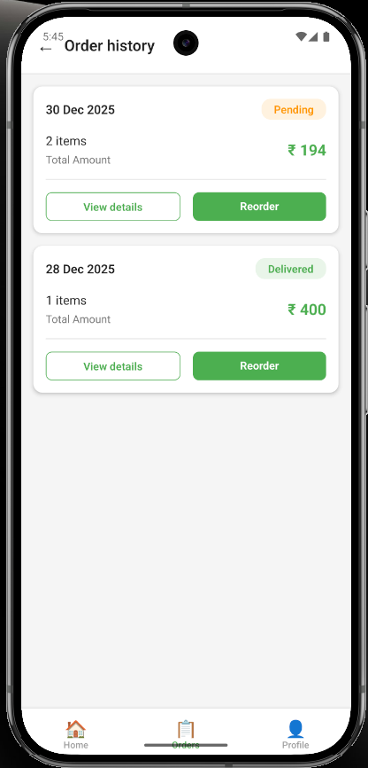
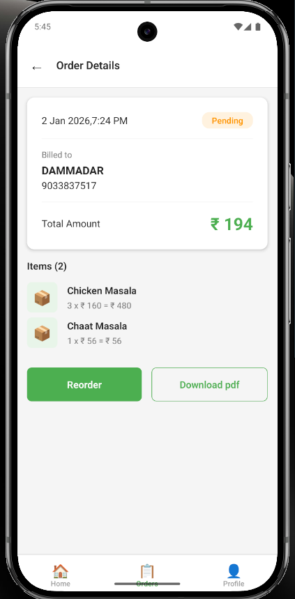

# ArkOrder

A modern mobile application for managing orders, customers, and inventory. Built with React Native and TypeScript.

## Features

- 🔐 **User Authentication** - Secure login system
- 🏪 **Area & Store Selection** - Choose your preferred location
- 🏠 **Home Dashboard** - Quick access to products and orders
- 🛒 **Shopping Cart** - Easy product selection and checkout
- 👥 **Customer Management** - Select and manage customers
- 📦 **Order History** - Track all past orders
- 📋 **Order Details** - View comprehensive order information
- 👤 **Profile Management** - Manage user settings and preferences

## Screenshots

<div align="center">

|             Login              |              Home              |              Area Selection               |
| :----------------------------: | :----------------------------: | :---------------------------------------: |
|  |  |  |

|               Store Selection               |           Order History            |                Order Details                |
| :-----------------------------------------: | :--------------------------------: | :-----------------------------------------: |
|  |  |  |

|                 Profile                  |
| :--------------------------------------: |
|  |

</div>

## Tech Stack

- **React Native** - Cross-platform mobile development
- **TypeScript** - Type-safe code
- **React Navigation** - Navigation management
- **Context API** - State management

## Getting Started

### Prerequisites

- Node.js (v14 or higher)
- npm or yarn
- React Native development environment setup

### Installation

```bash
# Install dependencies
npm install

# iOS specific
cd ios && pod install && cd ..

# Run on Android
npm run android

# Run on iOS
npm run ios
```

## Project Structure

```
src/
├── components/     # Reusable components
├── screens/        # Screen components
├── navigation/     # Navigation configuration
├── context/        # Context providers
├── constants/      # App constants
├── types/          # TypeScript types
└── utils/          # Utility functions
```

## License

This project is private and confidential.
